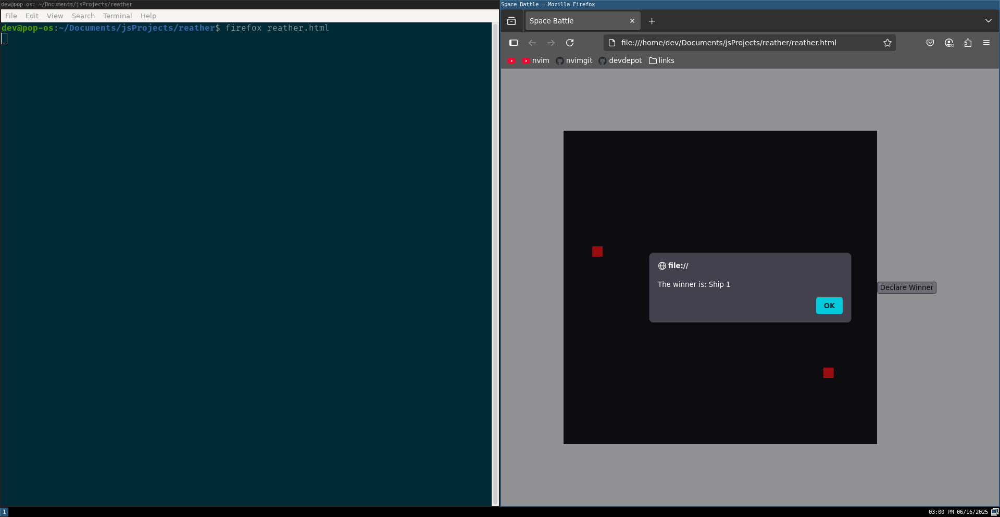

Space Battle Simulator
Overview
A simple 2D space battle simulator built with vanilla JavaScript and HTML5 Canvas. This project simulates a battle between two spaceships that move around and circle each other in a semi-random way.
Features

    2D rendering with HTML5 Canvas
    Semi-random spaceship movement
    Spaceships circle each other
    Winner declaration based on spaceship positions

Getting Started

Run the Game

    Open index.html in a web browser

Code Structure

    index.html: HTML structure and canvas element
    script.js: JavaScript code for game logic and animation

Future Development

    Add more complex game logic and rules
    Implement user input for spaceship control
    Enhance graphics and sound effects
